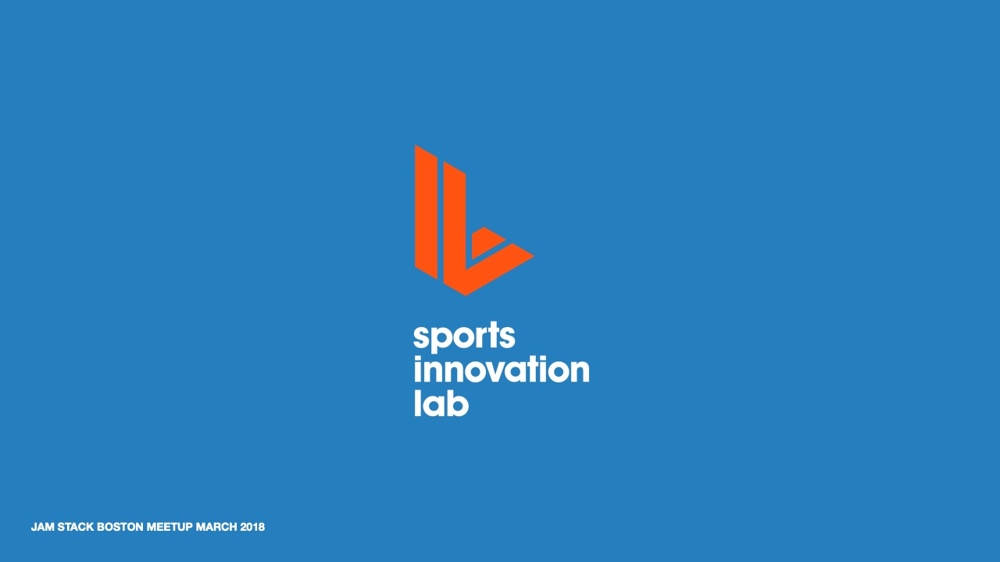
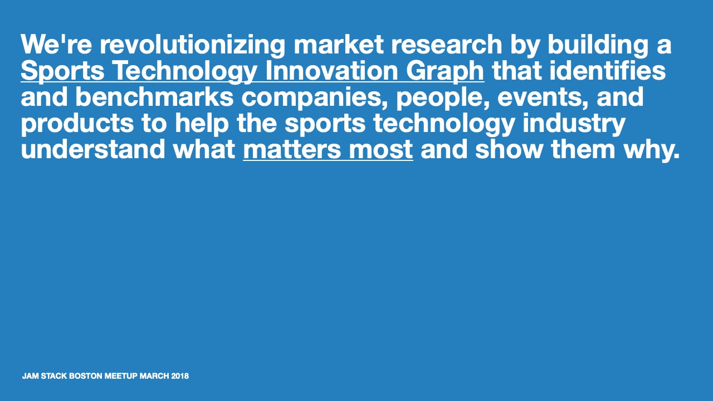
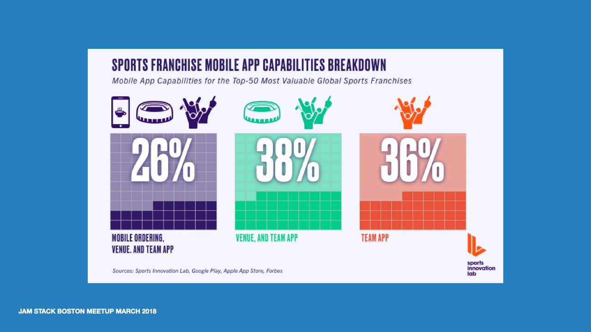
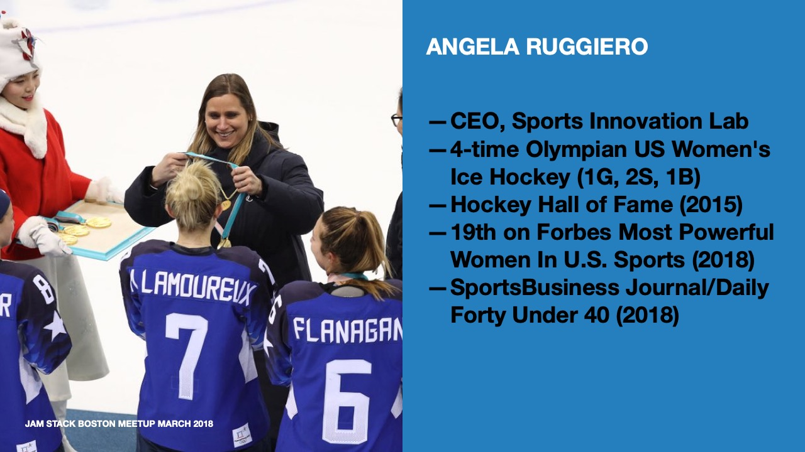
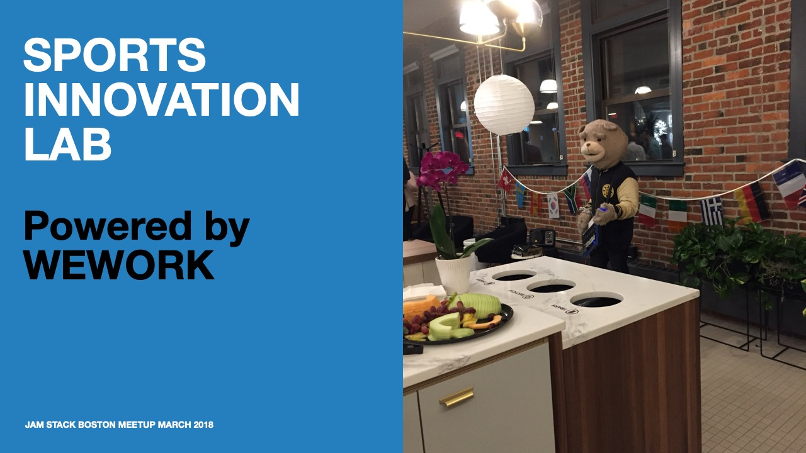
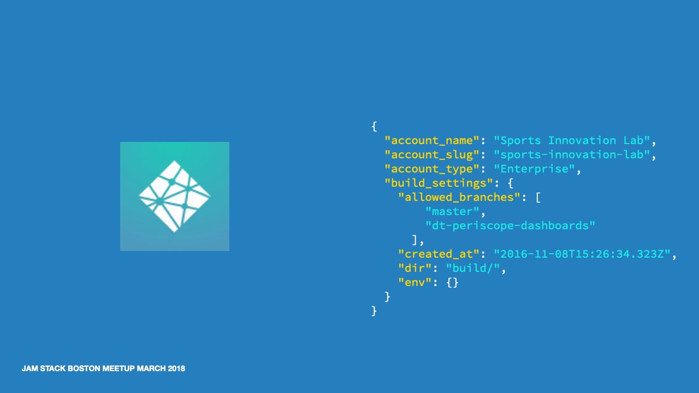
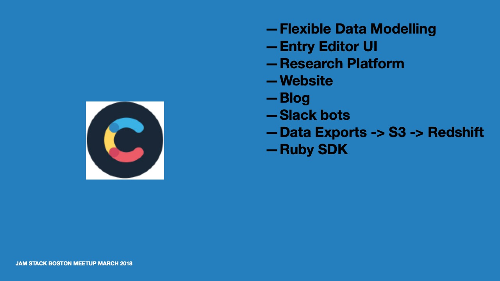
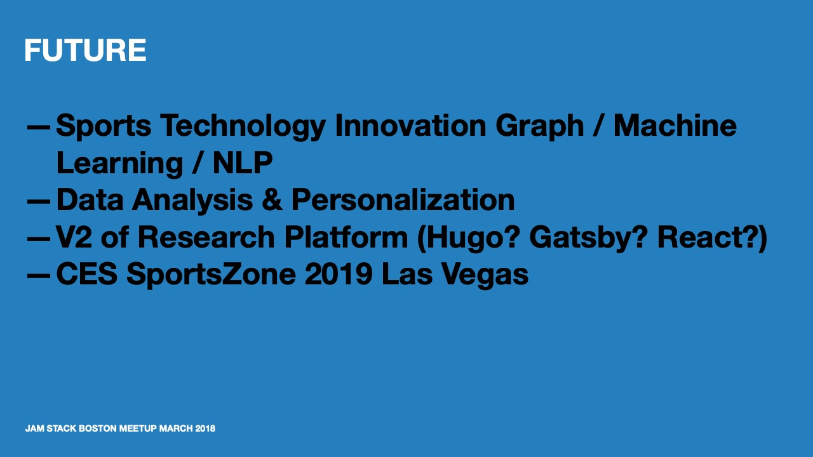
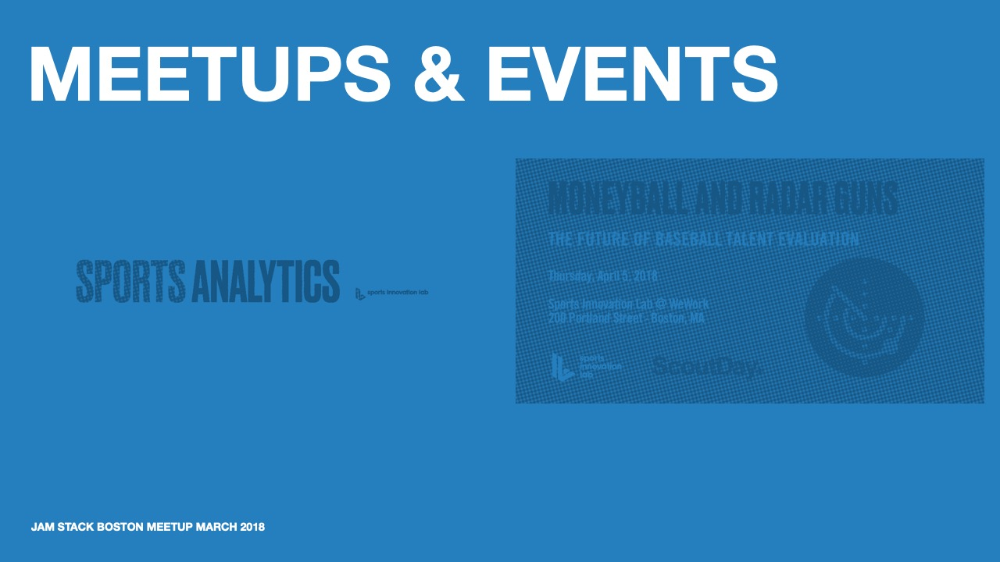

I joined Sports Innovation Lab in the fall of 2016 as part of the founding team in Boston.

Previously, I led the backend team at Intrepid Pursuits, a Cambridge, MA agency that built mobile and web apps for startups. I managed a small team of four engineers and was responsible for the architecture and implementation of the backend systems in Rails.

Finding myself at Sports Innovation Lab, it was just me and I had to figure out how to deliver the tools and apps we needed. I needed a new way of thinking about bulding modern web apps, hosting, managing infrastructure, and more.

I found JAMStack and Netlify thanks to some articles Matt Biilmann published and knew I had to learn more.

Netlify was a great fit for our needs and I quickly became a fan. In fact we bacme one of Netlfy's first enterprise customers and helped shape the platform to better support our needs -- specifically around authentication and authorization.

