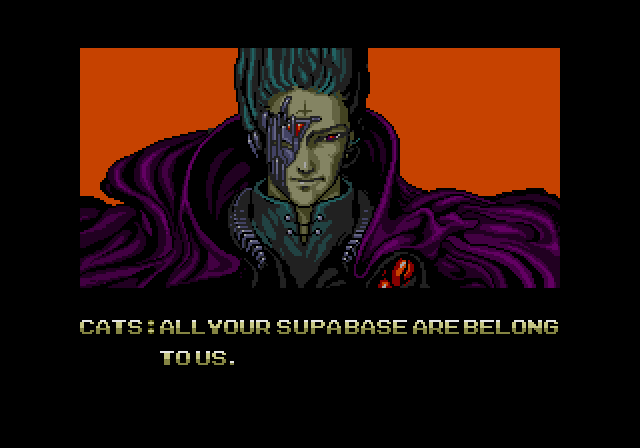

Supabase is the undisputed king of "meme-marketing" in the dev ops world.

Back in 2022, I consulted for them working on authentication and some early GraphQL examples.

One day, this classic meme just had to be made. It's a take on "All your base belong to us" meme that became popular in the late 90s.

Since I didn't have the font, I copied "Supabase" letter by letter from the existing text and pasted in place.

