### Background

Back in 2020, I started thinking about how startups start and grow. I realized that startups are like a band. Some startups are solo founders, some are duos, some are trios, etc.

That makeup often dictates the dynamics of the startup especially when it comes to the culture and how they scale.

Also, I knew from experience that startups lack many resources (both physical and digital) as they grow.

I wondered, could there be a "Startup as a Service" that could provide the resources that startups need to grow?

This is an unfinished deck, but one day I want to explore this idea further.

---

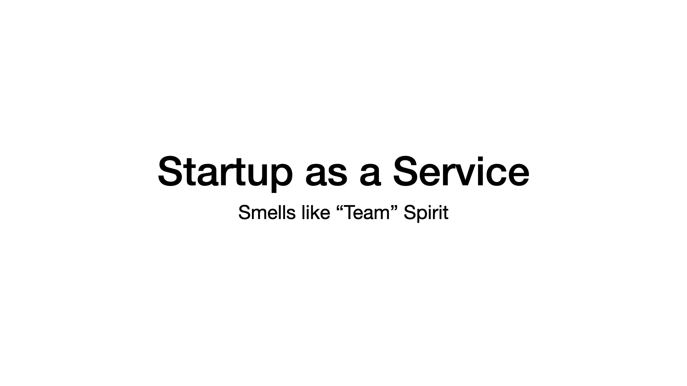

A take on the deodorant-scented slogan that became a revolutionary anthem for Gen X.

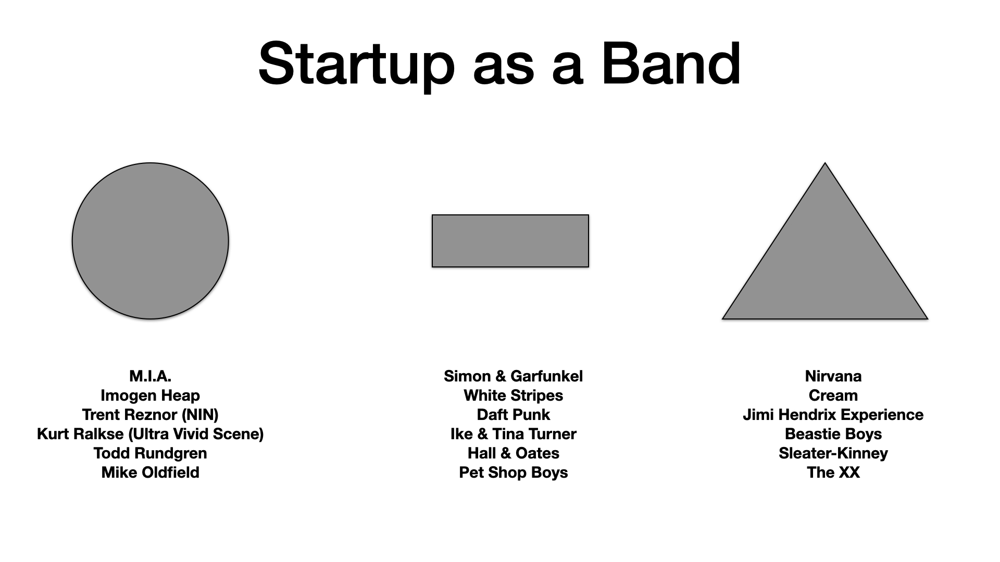

You have ⚪ solo startups where one person tries to fill all roles and play all instruments.

You have ▬ duos where one person does the business and the other the technology.

You have core founder ▲ groups where each have their function, but together deliver the vision.

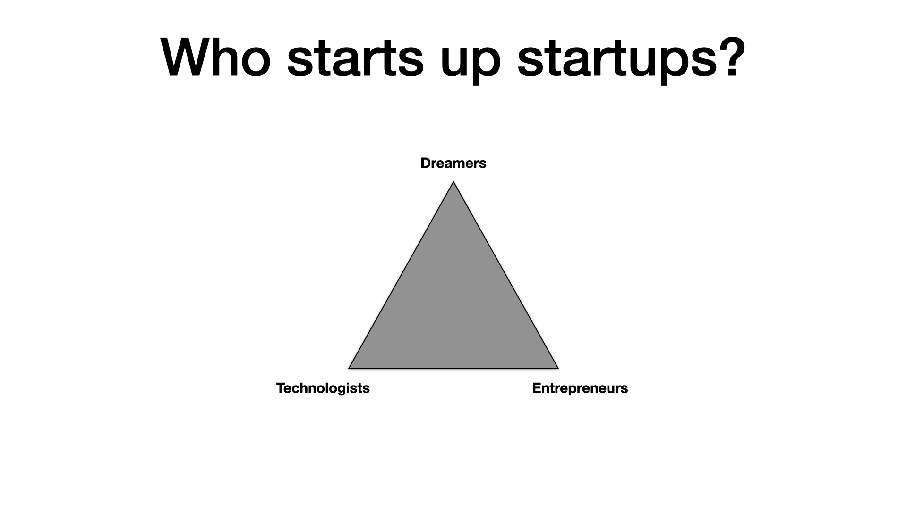

"Dreamer, you know you are a dreamer.
Well, can you put your hands in your head? Oh no!"

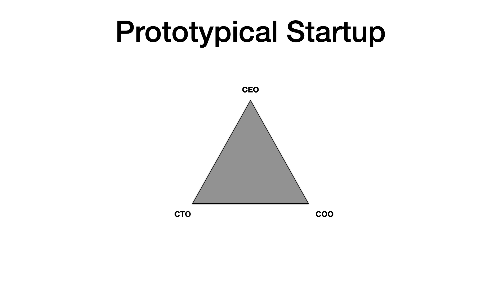

CEO's living the dream.

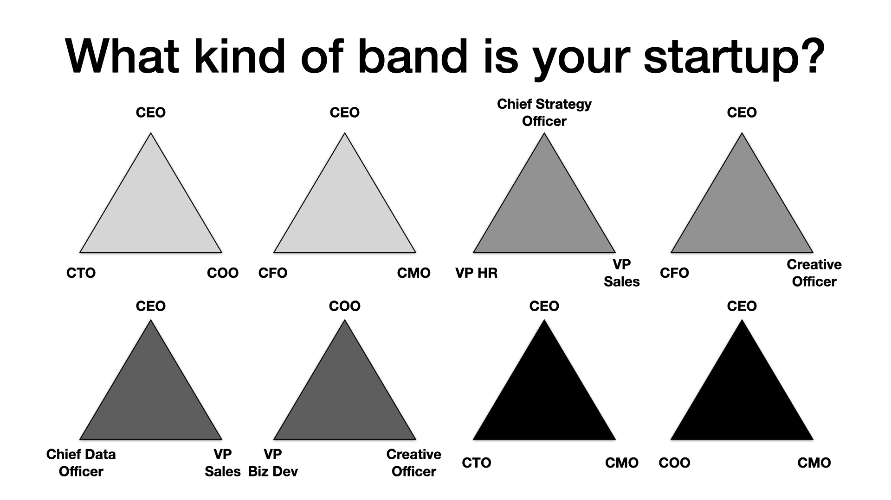

Startups are hard and you can't do it alone. But finding the right team and having clear roles and responsibilities is key to success.

every startup needs that creatice spark and the talent to deliver.

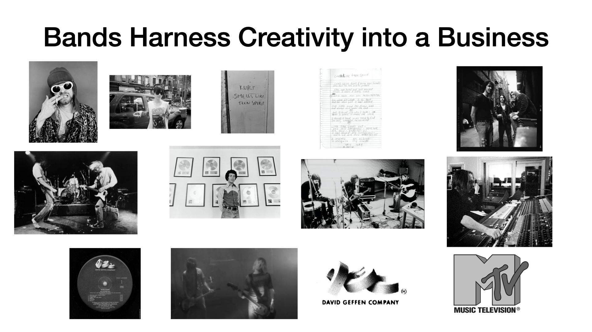

Startups aren't just ideas -- they are businesses. And busineses become comples ... fast.

Find your ICP. Find PMF. Find great design partners and people to help you on the way.

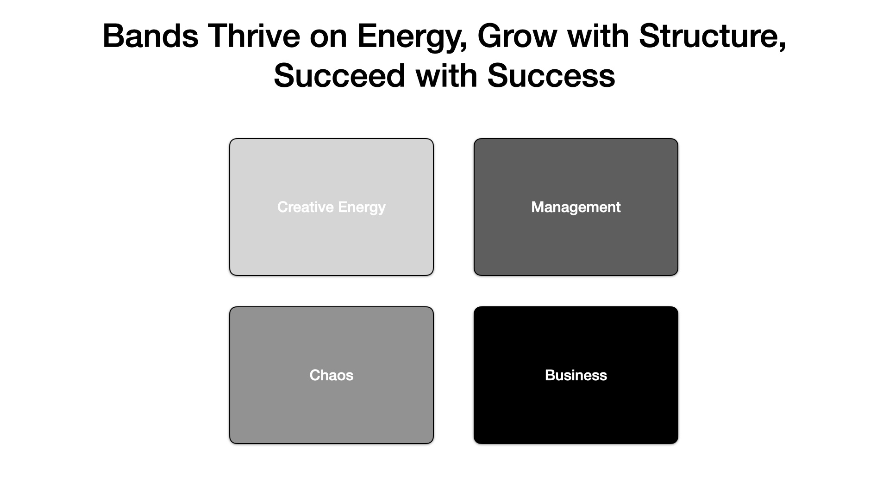

A little chaos can channel your creative energy to great things ....

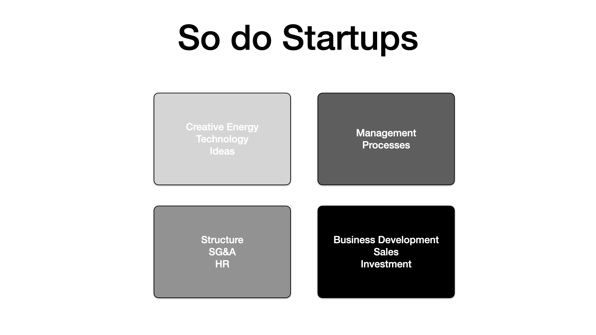

... and many of the best innovations.

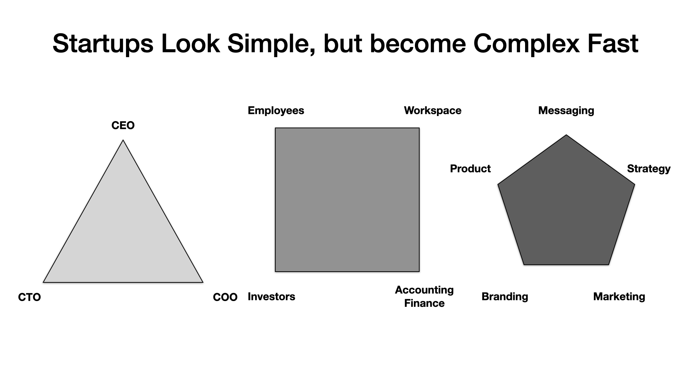

That complexity and overhead also presents itself when choosing the technology, architecture, and services needed to deliver on a startup's vision. What do I use? Who do I trust? Can I afford them? Am I betting on the right partner? That slows a startup down.

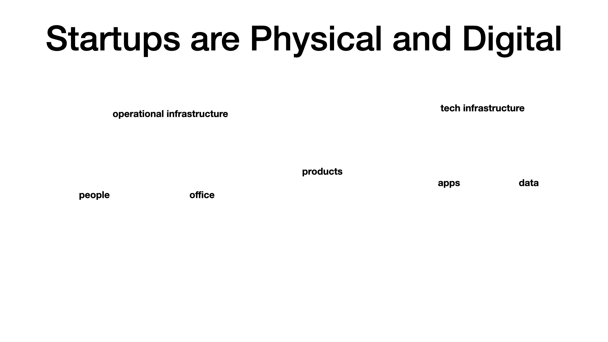

For startups, complexity compounds due to having to navigate both the digital and physical world.

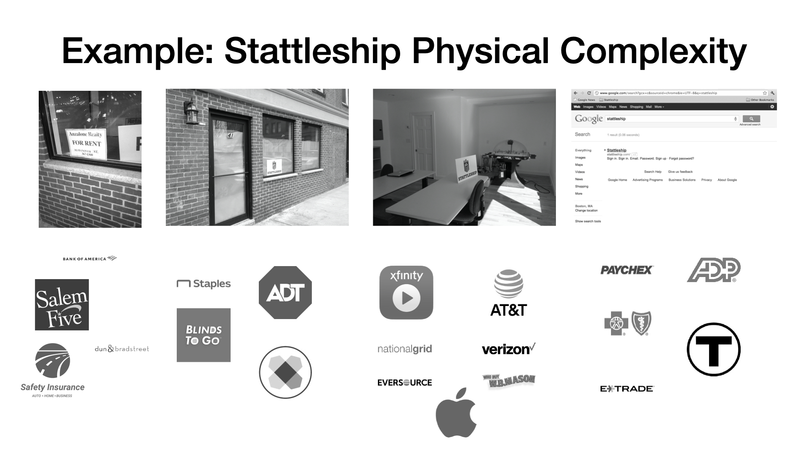

When I started Stattleship, I took on the complexity of a small office and all the costs and physical infrastructure that comes with it.

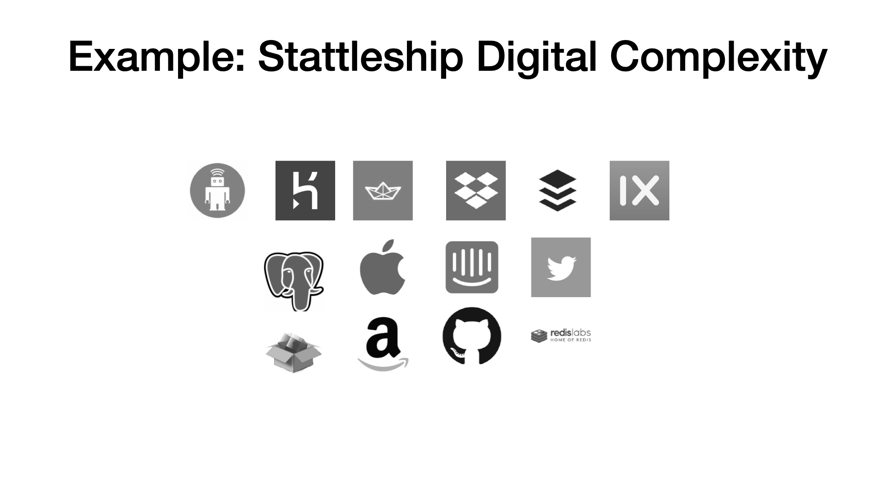

And then I added on the digital complexity of the services and partners needed to build the product.

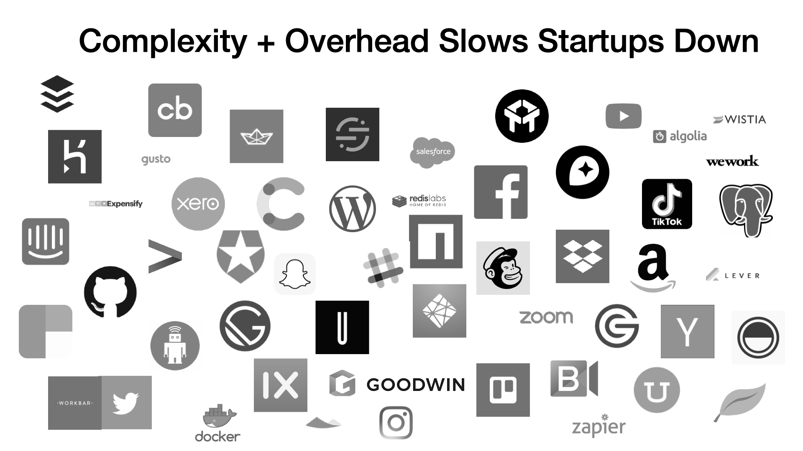

It can get overwhelming. Fast.

Not only do startups have to manage complexity, they have to manage constraints: you won't be able to have everything you need right away.

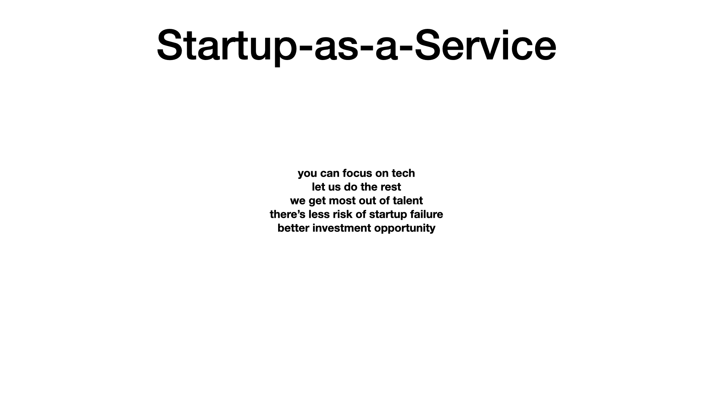

Question: Could you offer a "Startup as a Service" that provides the resources and support that startups need to grow?

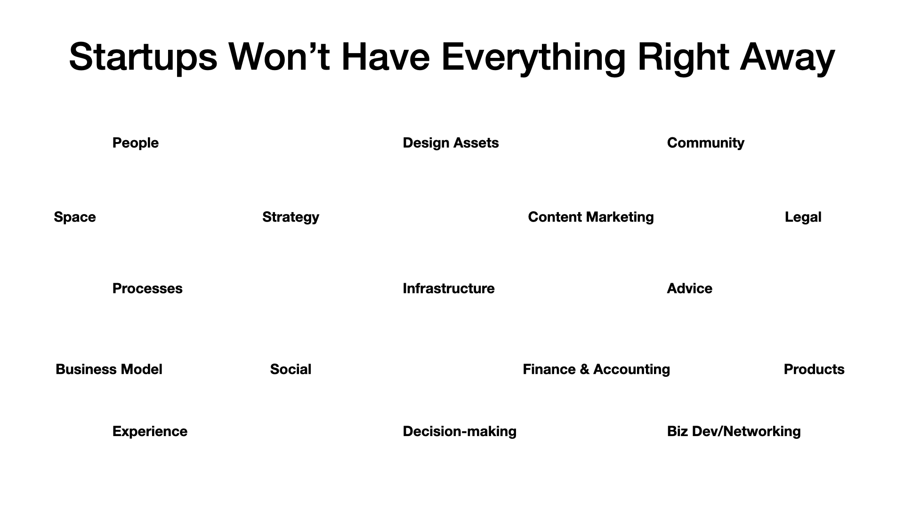

But, what if you could?

You don't need everything right away ... but you do need to know what and when and where to get it.

What if your latest startup had access to:

- A thoughtfully-priced plan with the Business/Enterprise features for your small (but hopefully growing) team

- Someone to pre-package a tech ecosystem of some of the best-in-breed, most used services modern web projects need

- The chance to get mentored by experts both in and outside the company

- Membership in a Startup Community that encourages your growth

- Blogs, social media, and case studies written about you that highlight not just you but the Developer Experience

That would be something special; and the company that provided this would be a company I'd stick with.

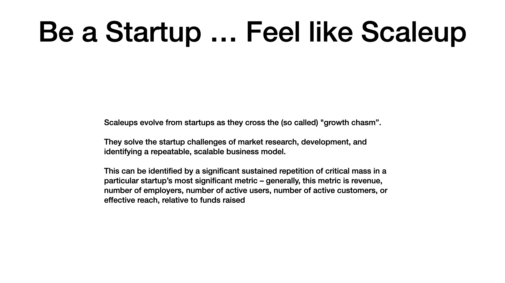

Because a startup is about "starting". If you are a 5 year old startup didn't you start already? You're scaling now.

And bands should also know how to play scales. :)
