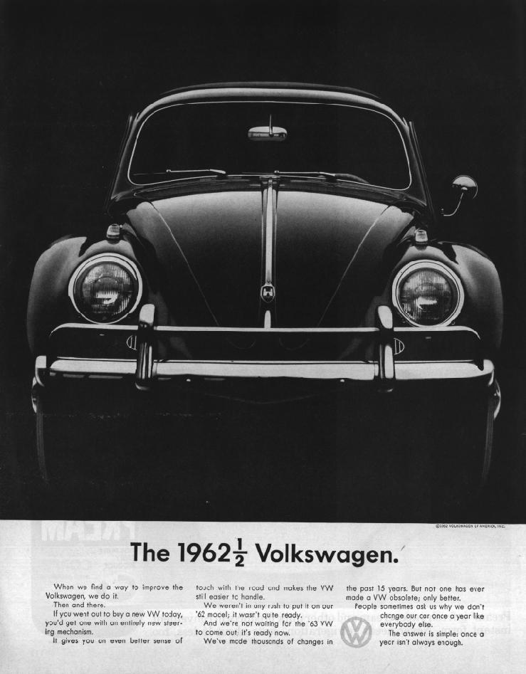

### Some Background

In college, I started collecting vintage Volkswagen advertisements. I'd go to antique malls and flea markets and look for issues of magazines with VW ads in them, cut them out, and add them to my collection.

In the mid-90's I realized I could host my own website from my Middlebury dorm room on my PowerComputing Power Center Macintosh clone. So, I did. And one of the first things I did was create a page dedicated to my VW ad collection.

The banner art comes from a VW Ad Planner I found at a VW car show one summer. The "Ads" text is rendered in that 90's 3D style that was popular at the time.

This is one of those pages.

---

A few people have e-mailed me wondering in which magazine issues and when these ads ran. So, here's a quick run-down (in chronological order) of those I know or can figure out based on the back of the ads. So, run out to your local flea market or maybe your grandparents' basement and look for these issues and then you too can start your very own VW Ad collection!

## 1960-1969

"The Volkwagen Theory of Evolution" - This ad appeared in the September 25, 1962 issue of LOOK magazine whose cover story discusses the emerging California lifestyle -- can you imagine spending 2 dollars a day on bubble bath? You can find the ad on page 97.

"The 1962 and a half Volkswagen" - From LOOK magazine, February 27, 1962. Cover asks, will Elizabeth Taylor's "new cleopatra look change your hairdo and makeup?" A fair question.

"Some shapes are hard to improve on." - From LOOK magazine, April, 9, 1963, page 73.

"Heard any volkswagen jokes lately?" - As I bought this one loose, I'm not exactly certain of the date this ad ran. But, the copyright is from 1963.

"It's a little too much car for the money" - This ad came from the May 5, 1964 issue of LOOK magazine, page 14.

"Takes pennies only." - March 24, 1964, LOOK magazine. Cover features a woman, on the beach, reading 'Post Historic Man' while the waves lap at her feet.

"Ugh." - LOOK magazine, April 7, 1964. Lead story is 'Inside England.' Cover has a picture of a young 'pre-Fergie' Prince Andrew. Ugh, indeed.

"Think it over, New York, Chicago, San Francisco." - July 28, 1964, LOOK magazine. Hey, isn't that the way things look in Mexico City?

"A Simple Story about a Simple Engine" - One of my better finds. This two page ad ran in the March 23, 1965 issue of LOOK magazine, pages 106-7. Each page is 10.5 x 13 inches. The cover story is an excellent discussion of race relations post Martin Luther King by Pulitzer prize winning author Robert Warren Penn.

"You're missing a lot when you own a Volkswagen" - LOOK magazine, February 23, 1965. All you ever wanted to know about Honolulu and the FBI.

"After we paint the car we paint the paint." - June 15, 1965 LOOK magazine. Cover story: "Seven wild color pages on the far-out world of Teen Music the din kids dig." I can dig it.

"Need a part?" - from the June 29, 1965 issue of LOOK: 'youth, morality, and how catholics really feel about birth control.'

"If this is a Station Wagon, this must be something else." - From LOOK, December 14, 1965 pages 6-7. My only Squareback ad.

"Don't let the low prices scare you off" -- 1966. Can't tell from which magazine.

"For the price of some station wagons and thier optional extras you can buy a VW Station Wagon and this optional extra." -- LOOK April 19, 1966. Is God dead? Is Ireland still with its troubles? And is Chaplin directing Sophia Loren? All in this issue!

"All for the price of a fancier priced car" -- July 1967. Can't tell from which magazine.

"Superwagon" - Can be found on the inside back cover of the March 22, 1968 issue of LIFE magazine. Front cover features a big shot of Ho Chi Minh.

## 1970-1979

"One hour later, it won't get hungry again" - Why can't all chinese food be delivered like this? Well, this one ran in U.S. News & World Report, August 9, 1971. President Nixon has just returned from "Red China" and the Washington Whispers column (on the back of the ad) discusses the future of diplomatic relations between the US and China. Irony anyone?

"Your very own love bug." - I bought this ad at a VW show. It appears to have come from a 1974 issue of Playboy. Target market?

## 1980-

"Volkswagen salutes the 1980 U.S.A Gold Medal Hockey Team" - How Mike Eruzione became famous. What a game. This ad came from the March 24, 1980 issue of TIME magazine, page 60. But, why are the players wearing both home and away jerseys?
