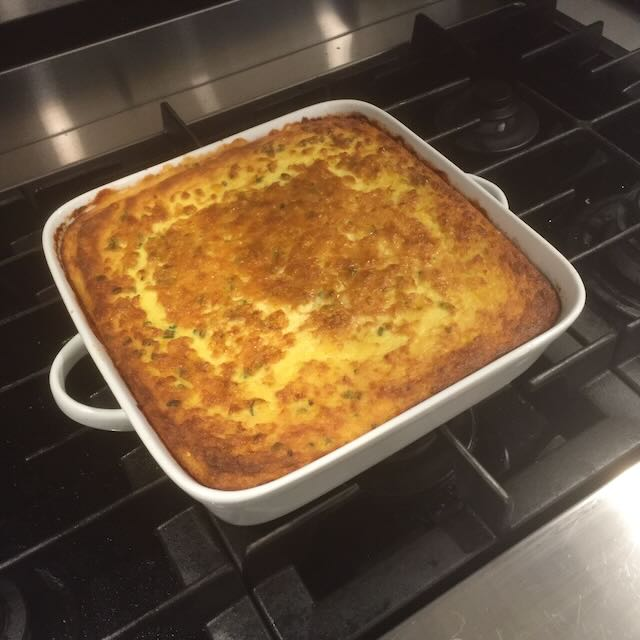

I make this corn pudding each Thanksgiving. The vanilla is key. Below is a real photo of the dish. 🌽

## Ingredients:

- 40 ounces corn 8 ears, fresh; canned and frozen (combo); just frozen/thawed
- 8 each eggs
- 4 cups whole milk
- 1/2 cup sugar
- 1 stick butter melted and cooled
- 6 tablespoons flour
- 2 teaspoons vanilla sugar vanilla bean or extract
- 1 teaspoon salt
- 1/2 teaspoon black pepper
- 1/3 cup chives fresh, chopped (I use dried most of the time)

## Directions:

1. Pulse half of the corn in a food processor
2. In a large bowl, combine pulsed corn with whole
   kernels. Add salt, pepper, chives.
3. In a small bowl, whisk together flour, milk, butter
   and vanilla.
4. Fold milk and egg mixture into corn.
5. Pour into lightly greased baking dish.
6. Bake at 350 degrees for 1 hour or until a knife inserted in the center comes out clean.
